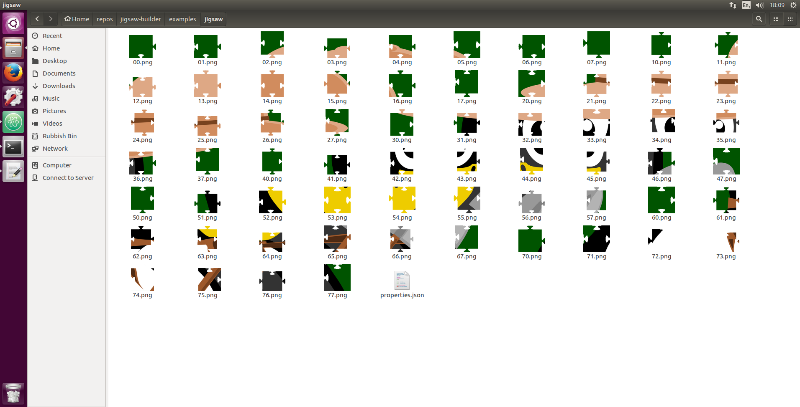

# Jigsaw Builder
This module is used to build a jigsaw from an image file. It was developed to be used in a [jigsaw game](https://github.com/CalumForsterDev/multiplayer-puzzle-game).

## Give it a quick try
```sh
# create working directory
$ mkdir example
$ cd example

# create package.json file:
$ npm init

# install jigsaw-builder
$ npm install jigsaw-builder --save

# create directory for jigsaw pieces
$ mkdir jigsaw
```
Move a test image into your project folder. Try [this image](https://raw.githubusercontent.com/CalumForsterDev/jigsaw-builder/master/examples/penguin.png):


Call it `penguin.png` and save it in your example directory with your `package.json` file.

Then create an `app.js` file to build the jigsaw:
```js
var build = require('jigsaw-builder').build

// To run this test, add a .png image to the examples directory
build(8, './penguin.png', './jigsaw/', function (err) {
  if (err) {
    console.log(err)
  }
  console.log('finished creating jigsaw!')
})
```

Save the `app.js` file in the same directory as the `package.json` file (`example/`).

Then run it!
```sh
$ node app.js
```

Then you should see this in your `jigsaw/` directory:



Now you can use these on pieces on your website or app. Have fun!


## Documentation
```js
var jigsawBuilder = require('jigsaw-builder')

/**
* The first argument is the jig-saw size
* i.e. a value of 8 will create an
* 8 by 8 jig-saw (64 piece).
* The second argument is the image
* you want to convert into jig-saw pieces.
* The third argument is the destination
* directory for the individual jig-saw
* files to be output to.
* The fourth argument is the callback.
**/
jigsawBuilder.build(8, './assets/penguin.png', './assets/jigsaw/penguin/', function (err) => {
  if (err) {
    console.error(err)
  }
})
```

### Output
The `.build` function, when called with the first argument `n`, produces `n*n` image files and a `properties.json` file. The `properties.json` file stores the relative coordinates of each jig-saw piece. This is needed because the tabs of each jig-saw piece stick out slightly, meaning the jigsaw piece's actual centre is shifted away from where you'd want to place it. This is hard to explain but a better explanation is being written and will be published soon.

### Function Used
To calculate the edges of the jig-saw pieces, this module uses the parametric equation
```
x = t + (1/4)sin(4pi*t),
y = (1/4)(cos(2pi*t)-1),
where 0 < t < 1.
```
More shapes and sizes will be added in future releases!

## Development
Feel free to contribute to the github project. Create issues and pull requests if you like. This package still has a long way to go! Thank you for any help.
